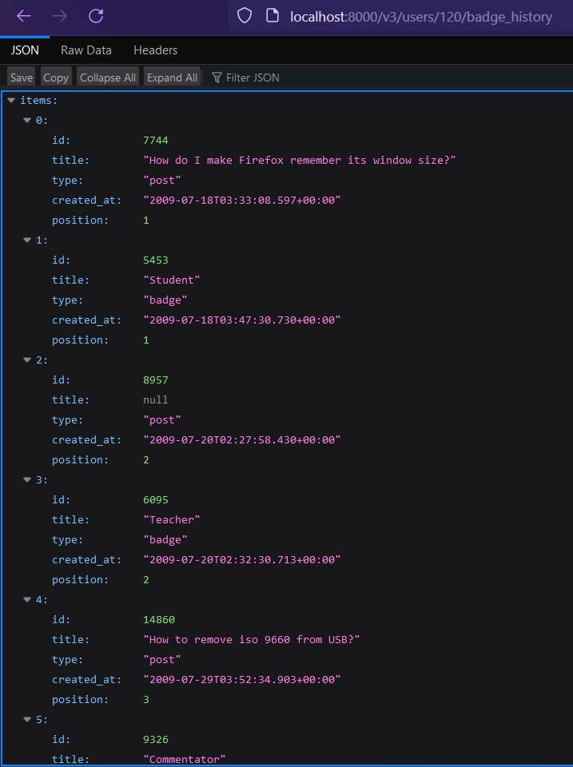

# Dokumentácia k zadaniu č. 3
Oleksandr Oksanich, AIS ID: 122480

Cvičenie: Dubec-Bencel, utorok 11:00
## Endpointy
### 1. endpoint
Tento dopyt funguje tak, že najprv spojí všetky príspevky a odznaky používateľa do jednej tabuľky cez `UNION` a zoradí to všetko podľa dátumu vytvorenia/získania. Potom na účely správneho párovania pridá druh (príspevok/odznaka) predchádzajúceho a nasledujúceho prvkov. Ďalej nechá iba tie príspevky, po ktorých nasleduje odznaka, resp. iba tie odznaky, pred ktorými je nejaky príspevok. Nakoniec pridá stĺpec "position" pomocou funkcie `ROW_NUMBER()`, ktora sa priradí každému páru post-badge vďaka príkazu `PARTITION BY type`, a zoradí sa celá výsledná tabuľka podľa dátumu vytvorenia prvkov.
```sql
SELECT id, title, type, created_at,
       ROW_NUMBER() OVER (PARTITION BY type ORDER BY created_at) AS position
FROM (
    SELECT *, LEAD(type) OVER () AS ld, LAG(type) OVER () AS lg
    FROM (
        SELECT id, name AS title, 'badge' AS type, date AS created_at
        FROM badges
        WHERE userid = $user_id
        UNION
        SELECT id, title, 'post' AS type, creationdate AS created_at
        FROM posts
        WHERE owneruserid = $user_id
        ORDER BY created_at
    ) achievements
) achievements
WHERE (type = 'post' AND ld = 'badge') OR (type = 'badge' AND lg = 'post')
ORDER BY created_at;
```
Príklad pre `/v3/users/120/badge_history`:


### 2. endpoint
SQL dopyt pre tento endpoint v prvom rade vyberie všetky príspevky, ktoré majú viac ako _n_ komentárov podľa zadania a majú poskytnutý tag. Výsledná tabuľka sa následne spojí s tabuľkami používateľov (kvôli "displayname") a komentárov. Z tabuľky komentárov dostane dátumy ich vytvorenia a pomocou window funkcie `LAG()` (s `PARTITION BY post_id` pre oddelenie komentárov jednotlivých príspevkov) získa informácie o vytvorení predchádzajúcich komentárov, resp. pôvodného príspevku (platí pre prvý komentár pre post). Takýmto spôsobom dostaneme rozdiel medzi dátumami a ten rozdiel použijeme na výpočet strednej dĺžky odpovede pomocou funkcie `SUM()` a príkazov `PARTITION BY post_id` (znovu pre správne oddelenie) a `ROWS UNBOUNDED PRECEDING`, aby sme spočítali iba predchádzajúce rozdiely. Každý získaný súčet je následne delený číslom komentára v rámci jednotlivého príspevku (funkcia `ROW_NUMBER()`). Nakoniec dopyt zoradí tabuľku podľa dátumu vytvorenia prispevku a jeho komentárov.
```sql
SELECT *, ROUND(SUM(diff) OVER (PARTITION BY post_id ORDER BY created_at ROWS UNBOUNDED PRECEDING)
                    / ROW_NUMBER() OVER (PARTITION BY post_id), 6) AS avg
FROM (
    SELECT p.post_id, p.title, users.displayname, comments.text,
           comments.creationdate AS created_at, p.post_created_at,
           ROUND(EXTRACT(EPOCH FROM (comments.creationdate -
                               LAG(comments.creationdate, 1, p.post_created_at) OVER (PARTITION BY p.post_id ORDER BY comments.creationdate))
           ), 6) AS diff
    FROM comments
    JOIN users ON users.id = comments.userid
    JOIN (
        SELECT posts.id AS post_id, posts.title AS title, posts.creationdate AS post_created_at
        FROM posts
        JOIN post_tags ON post_tags.post_id = posts.id
        JOIN tags ON post_tags.tag_id = tags.id
        JOIN comments ON posts.id = comments.postid
        WHERE tags.tagname = $tagname
        GROUP BY posts.id, posts.title, posts.creationdate
        HAVING COUNT(comments.id) > $count
    ) p ON p.post_id = comments.postid
) p
ORDER BY post_created_at, created_at;
```
Príklad pre `/v3/tags/networking/comments?count=40`:


### 3. endpoint
Dopyt pre túto úlohu najprv odfiltruje všetky príspevky, ktoré majú uvedený tag a aspoň _n_ komentárov (lebo ich musíme mať, keď chceme vypísať každý n-ty komentár pre príspevok). Taktiež každý príspevok vráti aj pole ID všetkých komentárov zoradené podľa dátumu ich vytvorenia a vytvorené pomocou agregáčnej funkcie `ARRAY_AGG()`. Nakoniec spraví `INNER JOIN` s tabuľkou používateľov kvôli stĺpcu "displayname" a vyberie n-ty komentár pre každý relevantný príspevok z poľa podľa poskytnutého indexu.
```sql
SELECT comments.id, users.displayname, p.body, comments.text, comments.score,
       ARRAY_POSITION(comment_ids, comments.id) AS position
FROM comments
JOIN users ON users.id = comments.userid
JOIN (
    SELECT posts.id AS post_id, posts.body,
           ARRAY_AGG(comments.id ORDER BY comments.creationdate) AS comment_ids
    FROM posts
    JOIN post_tags ON post_tags.post_id = posts.id
    JOIN tags ON post_tags.tag_id = tags.id
    JOIN comments ON posts.id = comments.postid
    WHERE tags.tagname = $tagname
    GROUP BY posts.id, posts.body, posts.creationdate
    HAVING COUNT(*) >= $position
    ORDER BY posts.creationdate
    LIMIT $limit
) p ON p.comment_ids[$position] = comments.id;
```
Príklad pre `/v3/tags/linux/comments/2?limit=1`:


### 4. endpoint
Tento jednoduchý SQL dopyt iba vyberie príspevok s príslušným ID a všetky príspevky, ktoré majú pôvodný post ako svojho predka; postupne zoradí tabuľku podľa dátumu vytvorenia postov a obmedzí ich počet.
```sql
SELECT displayname, body, posts.creationdate AS created_at
FROM posts
JOIN users ON posts.owneruserid = users.id
WHERE posts.id = $post_id OR posts.parentid = $post_id
ORDER BY created_at
LIMIT $limit;
```
Príklad pre `/v3/posts/2154?limit=2`:

