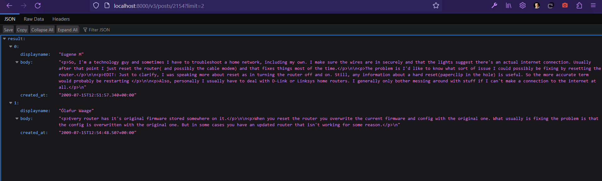

# Dokumentácia k zadaniu č. 2
## Endpointy
### 1. endpoint
Dopyt pre 1. endpoint jednoducho urobí INNER JOIN pre tabuľky používateľov a komentárov, zoradí používateľov podľa dátumu vytvorenia ich komentárov zostupne a vyberie potrebné údaje používateľov na základe ID príspevku z tabuľky komentárov.
```postgresql
SELECT users.id, reputation, users.creationdate,
       displayname, lastaccessdate, websiteurl,
       location, aboutme, users.views,
       upvotes, downvotes, profileimageurl,
       age, accountid
FROM users
JOIN comments ON comments.userid = users.id
WHERE comments.postid = $id
ORDER BY comments.creationdate DESC;
```
Príklad pre `/v2/posts/1819157/users`:


### 2. endpoint
Tento dopyt spája ID príspevkov, ktorých autorom je uvedený používateľ, a príspevkov, na ktorých ten komentoval, do jednej tabuľky pomocou subquery. Potom máme vnútorne spájané tabuľky používateľov a komentárov (aby sme mali len tych používateľov, ktorí majú nejaké komentáre) a spojíme ich s tabuľkou zo subquery cez INNER JOIN, aby sme dostali komentáre len na relevantných príspevkoch. Nakoniec usporiadame používateľov, začínajúc tými, ktorí sa zaregistrovali ako prví, a vyberáme potrebné údaje.
```postgresql
SELECT DISTINCT users.id, reputation, users.creationdate,
                displayname, lastaccessdate, websiteurl,
                location, aboutme, users.views,
                upvotes, downvotes, profileimageurl,
                age, accountid
FROM users
JOIN comments ON comments.userid = users.id
JOIN (
    SELECT posts.id
    FROM posts
    WHERE posts.owneruserid = $id
    UNION
    SELECT postid AS id
    FROM comments
    WHERE comments.userid = $id
) p ON comments.postid = p.id
ORDER BY users.creationdate;
```
Príklad pre `/v2/users/1076348/friends`:


### 3. endpoint
Tento dopyt vyberie všetky príspevky (vrátane aj tých, ktoré nemajú žiadny tag) pomocou LEFT JOINov s tagmi. Potom vyráta percentuálne zastúpenie príspevkov s uvedeným tagom v ramci celkového počtu príspevkov vytvorených v jednotlivých dňoch týždňa v UTC+0 a zaokrúhli to na dva desatinné miesta pomocou funkcie ROUND.
```postgresql
SELECT EXTRACT(ISODOW FROM posts.creationdate AT TIME ZONE 'UTC') AS dayofweek,
       ROUND(COUNT(*) FILTER (WHERE tagname = '$tag') * 100.0 / COUNT(DISTINCT posts.id), 2) AS ct
FROM posts
LEFT JOIN post_tags ON posts.id = post_tags.post_id
LEFT JOIN tags ON post_tags.tag_id = tags.id
GROUP BY dayofweek
ORDER BY dayofweek;
```
Príklad pre `/v2/tags/linux/stats`:


### 4. endpoint
Dopyt pre 4. endpoint iba odfiltruje všetky príspevky, vyberie len majúce dátum uzavretia, vypočíta ich trvanie v minútach a takisto zaokrúhli na dva desatinné miesta. Nakoniec usporiada príspevky od najnovších a vyberie potrebné informácie o uvedenom počte príspevkov.
```postgresql
SELECT id, creationdate, viewcount, lasteditdate, lastactivitydate, title, closeddate,
       ROUND(EXTRACT(EPOCH FROM (closeddate - creationdate)) / 60.0, 2) AS duration
FROM posts
WHERE closeddate IS NOT NULL AND ROUND(EXTRACT(EPOCH FROM (closeddate - creationdate)) / 60.0, 2) <= $minutes
ORDER BY creationdate DESC
LIMIT $limit;
```
Príklad pre `/v2/posts?duration=5&limit=2`:


### 5. endpoint
Pre tento dopyt som spojil tabuľky príspevkov a tagov pomocou LEFT JOIN, aby zostali aj príspevky bez tagov. Potom som odfiltroval ich podľa toho, či sa nachádza daný reťazec bez diakritiky a malými písmenami buď v názve alebo obsahu príspevkov. Ďalej som použil agregáčnu funkciu ARRAY_AGG na spojenie všetkých tagov, ktoré patria jednotlivým príspevkom. Ak nemá príspevok žiadny tag, tak bude sa tam nachádzať prázdne pole. Konečne som zoradil výsledky podľa datumu vytvorenia príspevkov, obmedzil som ich počet uvedeným v endpointe a vybral som potrebné údaje.
```postgresql
SELECT posts.id, creationdate, viewcount, lasteditdate, lastactivitydate,
       title, body, answercount, closeddate,
       COALESCE(ARRAY_AGG(tagname) FILTER (WHERE tagname IS NOT NULL), ARRAY[]::TEXT[]) AS tags
FROM posts
LEFT JOIN post_tags ON posts.id = post_tags.post_id
LEFT JOIN tags ON post_tags.tag_id = tags.id
WHERE UNACCENT(title) ILIKE UNACCENT('%$query%')
      OR UNACCENT(body) ILIKE UNACCENT('%$query%')
GROUP BY posts.id, creationdate
ORDER BY creationdate DESC
LIMIT $limit;
```
Príklad pre `/v2/posts?limit=2&query=linux`:

